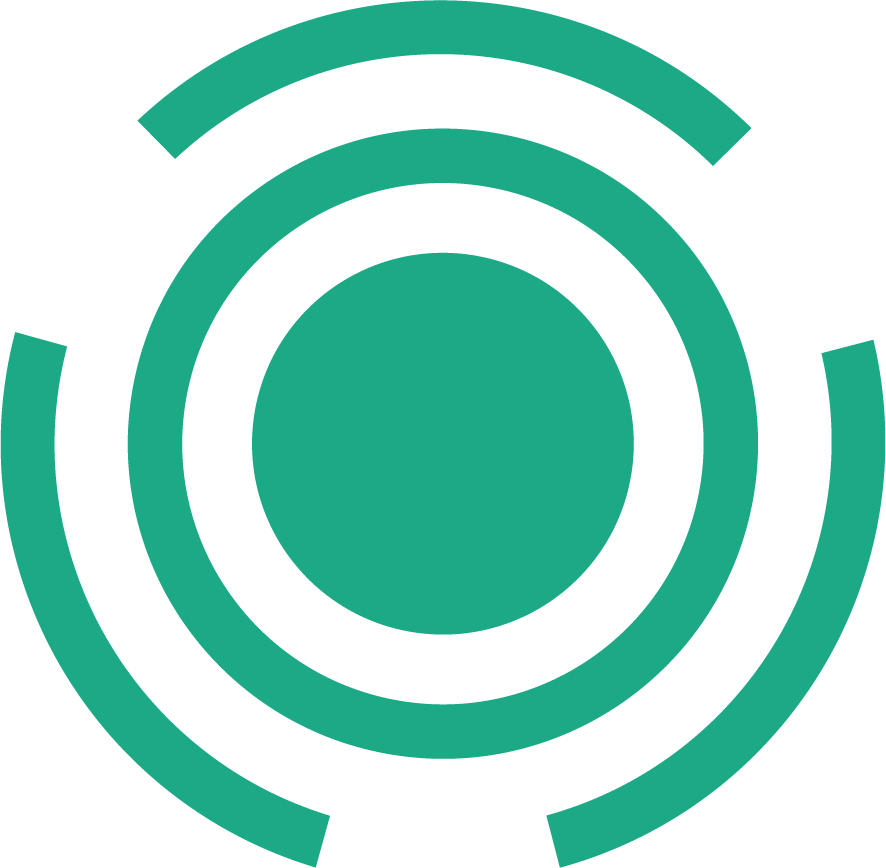

 

 
 
  
Listify your chaos, find your calm.

 
  

    <a href="https://stefanbrkic1.github.io/todo-app/">View Demo</a>
    &nbsp;·&nbsp;
    <a href="">Report Bug</a>
    &nbsp;·&nbsp;
    <a href="">Request Feature</a>
  

# Listify
ToDo Application for Productivity, and Task Managament.

 

<!-- ABOUT THE PROJECT -->
## Preview

3.jpg)
4.jpg)
5.jpg)
.jpg)

> **Note**  
>> Application is still under Development

 

## Built With

-    
-    
- 

 

## Tools Used

-     
-   
-   
-  
-   
-   
-     
-     
- 

 

## Features
- **Home** page
- **Menu** page
- **Contact** page 
- Modern **UI/UX** design
- **Responsive** for all devices **Desktop** , **Tablet** & **Mobile**

 

<!-- ACKNOWLEDGMENTS -->
## Acknowledgments

* Inspiration by [The Odin Project](https://www.theodinproject.com/)

 

## Author

👤 **stefanbrkic1**
* GitHub: [stefanbrkic1](https://github.com/stefanbrkic1)